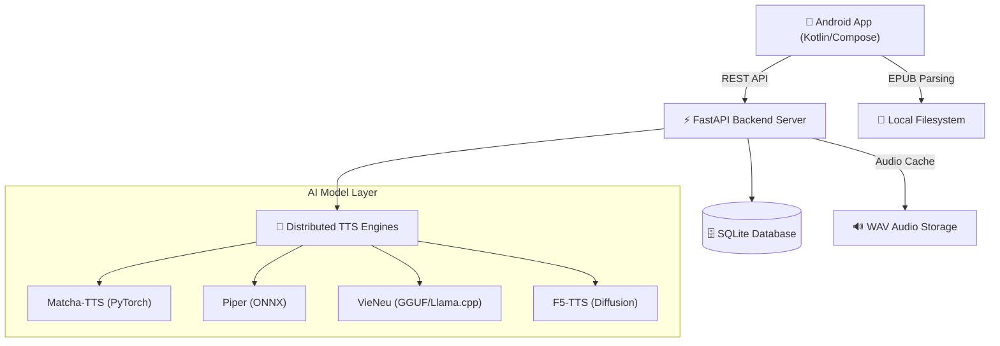

# 🎧 Trudio: AI-Powered Vietnamese Audiobook Ecosystem


Trudio is a cutting-edge full-stack solution that merges a native mobile application with advanced Natural Language Processing (NLP) to redefine the reading and listening experience for Vietnamese users.

**Trudio** là một giải pháp full-stack đột phá, kết hợp giữa ứng dụng di động bản địa (Native Mobile App) và hệ thống xử lý ngôn ngữ tự nhiên (NLP) tiên tiến để mang lại trải nghiệm đọc và nghe sách tối ưu cho người Việt.

[](https://github.com/alida/Trudio)
[](https://github.com/alida/Trudio)
[](LICENSE)

---

## 🌟 Key Features / Tính năng Nổi bật

### 1. Smart EPUB Reader & Sync (Trình đọc & Phát Audio Đồng bộ)
*   **AI Audiobook Generation**: Automatically converts EPUB chapters into high-quality audio using distributed AI models.
*   **Visual Sync & Highlighting**: Synchronizes text highlighting with audio playback, allowing users to follow along perfectly.
*   **Offline Mode**: Full support for local storage and playback of synthesized audio blocks.

### 2. Distributed TTS Ecosystem (Hệ thống TTS Phân tán)
Trudio integrates multiple world-class AI models specialized for Vietnamese phonetics:
*   **Matcha-TTS**: Exceptional performance with highly natural Vietnamese prosody.
*   **Piper (ZaloPay/Vivos)**: Optimized for speed, stability, and on-device execution (ONNX).
*   **VieNeu (GGUF)**: Leverages Large Language Model (LLM) architectures for context-aware intonation.
*   **F5-TTS**: Studio-quality sound using state-of-the-art Diffusion technology.

### 3. Premium User Experience (Trải nghiệm Người dùng Cao cấp)
*   **Floating Mini Player**: A sleek, draggable pill overlay that allows multitasking across the Android OS.
*   **Social Hub & Library**: Integrated community system to discuss books, share reviews, and manage personal shelves.
*   **Modern Aesthetic**: Dark Mode first design built with **Jetpack Compose** and **Material3**.

---

## 🏗️ System Architecture / Kiến trúc Hệ thống



---

## 🛠️ Technical Stack / Chi tiết Công nghệ

### Frontend (Android Native)
- **UI Framework**: Jetpack Compose (Modern Declarative UI).
- **Architecture**: MVVM (Model-View-ViewModel) with Coroutines & Flow.
- **Local Storage**: Room Persistence Library for bookshelf & progress tracking.
- **Networking**: Retrofit 2 + OkHttp for asynchronous backend communication.
- **Media Engine**: ExoPlayer for seamless, low-latency audio streaming.

### Backend (Python)
- **Framework**: FastAPI (Asynchronous, High-performance).
- **ORM**: SQLAlchemy & Pydantic for data integrity.
- **AI Integration**:
    - `Matcha-TTS`: Custom Vietnamese text cleaners.
    - `Piper`: High-speed ONNX runtime integration.
    - `VieNeu`: llama-cpp-python for GGUF model execution.
- **Deployment**: Configured for NVIDIA CUDA acceleration.

---

## 📂 Project Structure / Cấu trúc Thư mục

```text
.
├── backend/                # FastAPI server and TTS orchestration logic
│   ├── routers/            # API endpoints for Books, Posts, Users, Groups
│   ├── app.db              # SQLite Database (Auto-seeded)
│   └── main.py             # Main entry point for the unified API
├── frontend/
│   └── TextToSound/        # Native Android Source code (Kotlin)
│       ├── app/            # Main application module
│       └── ui/             # Jetpack Compose Screens & Components
├── Model_API/              # Model weights and independent API handlers
│   ├── f5-tts/             # State-of-the-art Diffusion model
│   ├── piper/              # High-efficiency ONNX models
│   └── vieneu/             # Context-aware GGUF models
└── README.md               # Main project documentation
```

---

### 🚀 Quick Start (Automated Setup)

For regular users and developers, we provide an automated setup tool that configures the environment and prepares the project structure:

```bash
# Clone the repository
git clone https://github.com/congkx123789/app_TTS_android-.git
cd app_TTS_android-

# Run the setup tool (Replace with your Hugging Face token)
python3 setup_project.py <YOUR_HF_TOKEN>
```

---

## 🛠️ Detailed Setup / Hướng dẫn Khởi chạy

### 1. Backend Setup
Recommended: `Conda` or `Venv` with `Python 3.10+`.

```bash
cd backend
# Install dependencies
pip install -r requirements.txt

# Configure your environment
cp .env.example .env
# Edit .env with your specific paths and tokens

# Start the core server (Port 8000)
bash start_server.sh
```

### 2. Distributed Model APIs
To use specific models, you can run their dedicated servers:
```bash
# Example for Piper
cd Model_API/piper && python api_piper.py
```

### 3. Frontend Deployment
Open the `frontend/TextToSound` folder in **Android Studio**.

```bash
# Launch your emulator (e.g., Pixel 8)
~/Android/Sdk/emulator/emulator -avd Pixel_8 -gpu host
```
- Click the **▶ Run** button in Android Studio to deploy to the emulator.

---

## 📑 Documentation / Tài liệu Tham khảo
- [APP_OVERVIEW.md](APP_OVERVIEW.md): Detailed feature list and UI breakdown.
- [MODEL_API_GUIDE.md](MODEL_API_GUIDE.md): Technical guide for independent TTS APIs.
- [HOW_TO_RUN.md](HOW_TO_RUN.md): Advanced setup & troubleshooting guide.

---

## 👨‍💻 Author
**Trudio** is built with passion for Vietnamese literature and AI technology. 🇻🇳
Built by [Alida](https://github.com/alida) - Making knowledge accessible through sound.
