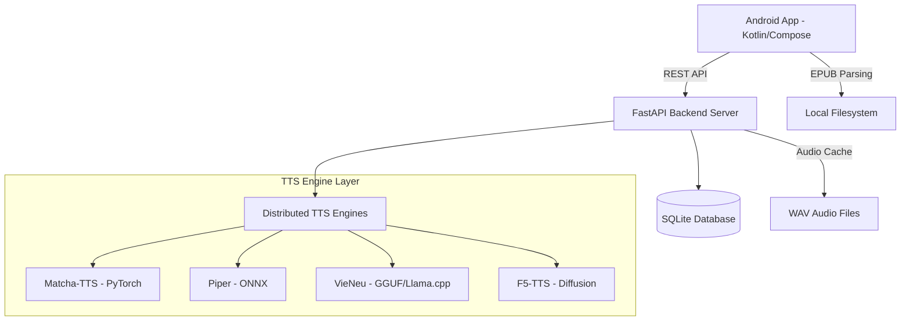

# 🎧 Trudio: AI-Powered Vietnamese Audiobook Ecosystem

Trudio là một giải pháp full-stack đột phá, kết hợp giữa ứng dụng di động bản địa (Native Mobile App) và hệ thống xử lý ngôn ngữ tự nhiên (NLP) tiên tiến để mang lại trải nghiệm đọc và nghe sách tối ưu cho người Việt.


---

## 🌟 Tính năng Nổi bật

### 1. Trình đọc & Phát Audio Đồng bộ (EPUB Sync)
*   **Audiobook Generation**: Tự động chuyển đổi các chương sách EPUB thành âm thanh chất lượng cao bằng AI.
*   **Highlighting**: Tự động đánh dấu đoạn văn đang được đọc giúp người dùng dễ dàng theo dõi.
*   **Offline Mode**: Hỗ trợ lưu trữ cục bộ các đoạn âm thanh đã tổng hợp.

### 2. Hệ thống TTS Đa mô hình (Distributed TTS)
Trudio tích hợp hệ thống backend phân tán, cho phép chuyển đổi linh hoạt giữa các "vật chủ" giọng nói:
*   **Matcha-TTS**: Hiệu năng vượt trội, giọng đọc Tiếng Việt có độ tự nhiên cao.
*   **Piper (ZaloPay/Vivos)**: Tối ưu cho tốc độ và tính ổn định.
*   **VieNeu (GGUF)**: Sử dụng kiến trúc transformer hiện đại cho ngữ điệu thông minh.
*   **F5-TTS**: Chất lượng phòng thu nhờ công nghệ Diffusion.

### 3. Trải nghiệm Người dùng Cao cấp
*   **Floating Mini Player**: Trình phát nhạc nổi cho phép đa nhiệm linh hoạt trên hệ điều hành Android.
*   **Social Hub**: Hệ thống cộng đồng tích hợp, cho phép người dùng thảo luận và chia sẻ sách.
*   **Clean Design**: Giao diện Modern Dark Mode chuẩn Material3.

---

## 🏗️ Kiến trúc Hệ thống



---

## 🛠️ Chi tiết Công nghệ

### Frontend (Android Native)
*   **UI**: Jetpack Compose (Declarative UI).
*   **Architecture**: MVVM (Model-View-ViewModel).
*   **Database**: Room Persistence (Lưu trữ kệ sách & bookmark).
*   **Network**: Retrofit 2 + OkHttp (Giao tiếp Backend).
*   **Media**: ExoPlayer (Xử lý phát âm thanh mượt mà).

### Backend (Python Service)
*   **Framework**: FastAPI (Asynchronous execution).
*   **ORM**: SQLAlchemy & Pydantic.
*   **TTS Integration**:
    *   `Matcha-TTS`: Custom Vietnamese cleaners.
    *   `Piper`: Optimized ONNX runtimes.
    *   `VieNeu`: Llama-cpp integration.
*   **Environment**: Conda (Python 3.10+).

---

## 📂 Cấu trúc Thư mục

```text
.
├── frontend/             # Mã nguồn ứng dụng Android (Kotlin)
├── backend/              # Server quản lý dữ liệu và điều phối TTS
├── Model_API/            # Chứa các handler và model weights cho TTS
│   ├── f5-tts/           # Model F5-TTS
│   ├── piper/            # Model Piper (ONNX)
│   └── vieneu/           # Model VieNeu (GGUF)
├── static/               # Tài nguyên tĩnh (Cover images, epub samples)
└── README.md             # Tài liệu dự án
```

---

## 🚀 Hướng dẫn Cài đặt & Khởi chạy

### 1. Cấu hình Backend
Yêu cầu: `Conda` hoặc `Python 3.10+` và `CUDA` (khuyên dùng).

```bash
# Di chuyển vào thư mục backend
cd backend

# Khởi tạo môi trường (Nếu dùng Conda)
conda activate matcha

# Cài đặt thư viện
pip install -r requirements.txt

# Khởi chạy server
bash start_server.sh
```

### 2. Khởi chạy Emulator & App
Sử dụng Android Studio để mở thư mục `frontend/TextToSound`.

```bash
# Khởi chạy emulator từ terminal
~/Android/Sdk/emulator/emulator -avd Pixel_8 -gpu host

# Deploy app từ Android Studio (Nhấn nút Run)
```

---

## 📑 Tài liệu Tham khảo
*   [APP_OVERVIEW.md](APP_OVERVIEW.md): Tổng quan chi tiết về ứng dụng.
*   [MODEL_API_GUIDE.md](MODEL_API_GUIDE.md): Hướng dẫn chi tiết cấu hình các mô hình TTS.
*   [HOW_TO_RUN.md](HOW_TO_RUN.md): Hướng dẫn khắc phục sự cố và thiết lập môi trường.

---

## 👨‍💻 Tác giả
Dự án được phát triển với tình yêu dành cho sách và công nghệ AI Việt Nam. 🇻🇳
